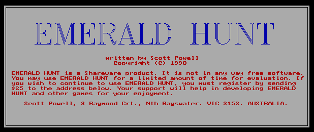
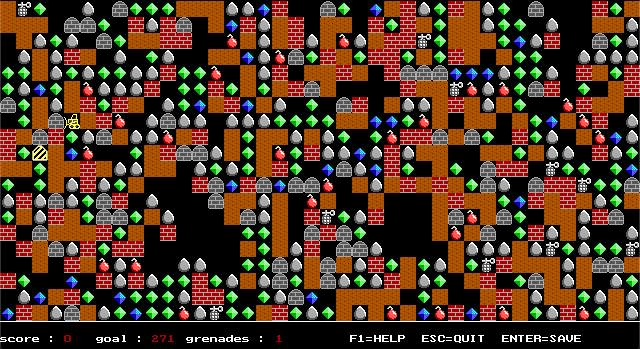

# Emerald Hunt

Emerald Hunt is a game I played a LOT in the 90s.

When I started this project back in 2014, I could not find a copy of the original game.  Out of nostalgia, and a desire to challenge myself, I decided to recreate the game from memory in JavaScript.  I found some online images of a Palm PC version of the game (!), and got to work.

Eventually during development, I found a copy of the game, and uploaded it to [Abandonia](http://www.abandonia.com/en/games/31445/Emerald+Hunt.html).  It runs perfectly well in DosBox, and this helped a lot with development.

This project was for personal pleasure, and to practice my JavaScript coding.  To that end, I decided not to use any additional libraries (eg jQuery) and use native JavaScript for everything.

## History of development

During the original development (2014), the game got to the point where it was more fun to play than to develop, and development stopped.

Sometime around 2019 I learnt about asynchronous programming, and that JavaScript could support some OOP design styles, so I started a rewrite.  Between 2019-2020 I got a reasonable chunk done before development stalled again.

I finally picked it up again in 2022, and "finished" it off.

## Cool features

The game reads the sprite data directly from the original resource files (`resources\objects.dat`).  The original game also has a level editor (`build.exe`) and a sprite editor (`buildobj.exe`), so new sprites can be generated and used.

Since the original game used a PC speaker (this was pre-SoundBlaster days), I figured I could reproduce the same crappy audio.

It would have been easy to record the `.wav` files, and replay them.  Too easy.  So instead I recorded the DosBox audio, analysed it in Audacity, worked out the square-wave frequencies and timespans, and recreated them using JavaScript [AudioContext APIs](https://developer.mozilla.org/en-US/docs/Web/API/AudioContext).